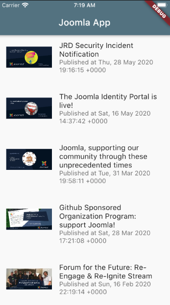

# JaB 2020 Demo Flutter App

A demo Flutter App for my presentation at #JAB2020 (jandbeyond.org).

## Getting Started

This project is a starting point for a Flutter application.

### Docs about Flutter

A few resources to get you started if this is your first Flutter project:

- [Lab: Write your first Flutter app](https://flutter.dev/docs/get-started/codelab)
- [Cookbook: Useful Flutter samples](https://flutter.dev/docs/cookbook)

For help getting started with Flutter, view our
[online documentation](https://flutter.dev/docs), which offers tutorials,
samples, guidance on mobile development, and a full API reference.

### Docs about Joomla

Best place to know about Joomla it's [Joomla Documentation Portal](https://docs.joomla.org)

## How to use this code

After checking out the code, just open it with Code and start simulator (F5). That should give you a view of your app.
